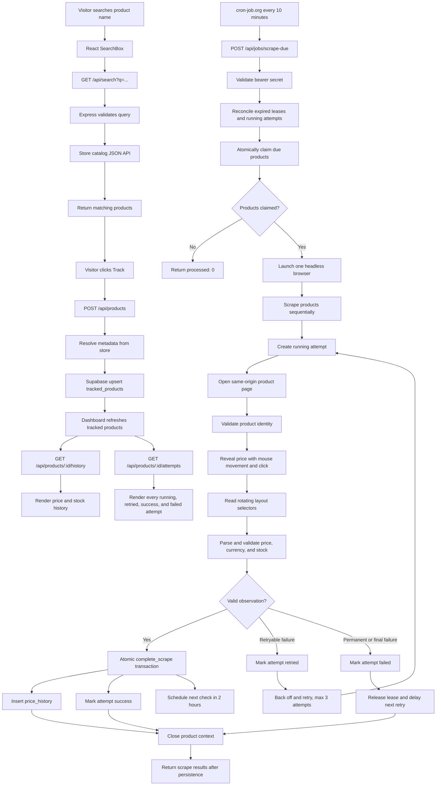

# PricePulse execution flow

This document describes how a product moves through PricePulse, from a visitor's search to a persisted scrape result.

## System flow



## Request flows

### Search and tracking

1. The frontend debounces the search input and calls `GET /api/search`.
2. The API validates a 2–80 character query.
3. The backend loads the mock store catalog through its same-origin JSON endpoint, using a short in-memory cache, and filters by name, brand, or SKU.
4. Tracking sends only the selected numeric store product ID. The backend resolves the product itself, builds the canonical store URL, and upserts `tracked_products`.
5. New and reactivated products are immediately due for their first check.

### Scheduled scrape

The external scheduler calls the protected endpoint every ten minutes. The scheduler is intentionally more frequent than the two-hour product interval: PostgreSQL, not the scheduler or Node process, decides whether a product is due.

The claim function locks eligible rows with `FOR UPDATE SKIP LOCKED`, writes an expiring lease, and returns the claimed products. This means overlapping cron requests cannot scrape the same product. An expired lease can be claimed again after a crashed process.

Each claimed product is processed sequentially in one shared browser. A separate attempt row is created before every application-level scrape attempt. The store's own reveal retries remain inside that browser attempt.

### Scrape and persistence

The scraper uses HTTP for product metadata and Playwright for the interactive price reveal. It restricts navigation to `demo.inelabteamdev.com`, waits for the product heading, captures the current `/api/layout` response, performs the required mouse movement, and clicks the reveal button. It then reads only the layout-provided price and stock classes.

The parser rejects missing or malformed values, unknown currencies, loading placeholders, and ambiguous stock text. A successful observation is saved through `complete_scrape`, which inserts `price_history`, marks the attempt successful, clears the lease, and schedules the next scrape in one database transaction.

Retryable network, timeout, rate-limit, server, reveal, and delayed-layout failures are retried up to three total attempts with approximately two and five second backoffs. The prior attempt is marked `retried` only when the next attempt is actually starting. A final or permanent failure is marked `failed`, retained for the dashboard, and does not create price history.

## Manual headed flow

```text
npm run scrape:headed -- --product <mock-store-product-id>
        |
        v
same scrapeProduct() production path
        |
        v
Playwright headed browser -> visible reveal interaction -> validated observation
```

The headed command is read-only: it does not claim a tracked row or write to Supabase. It is intended for demonstrations and live storefront inspection.

## Data relationships

```text
tracked_products 1 ──── * scrape_attempts
tracked_products 1 ──── * price_history
scrape_attempts  1 ──── 0..1 price_history
```

`price_history.attempt_id` points to the successful attempt that produced the observation. Failed and retried attempts remain visible without producing a history row.

